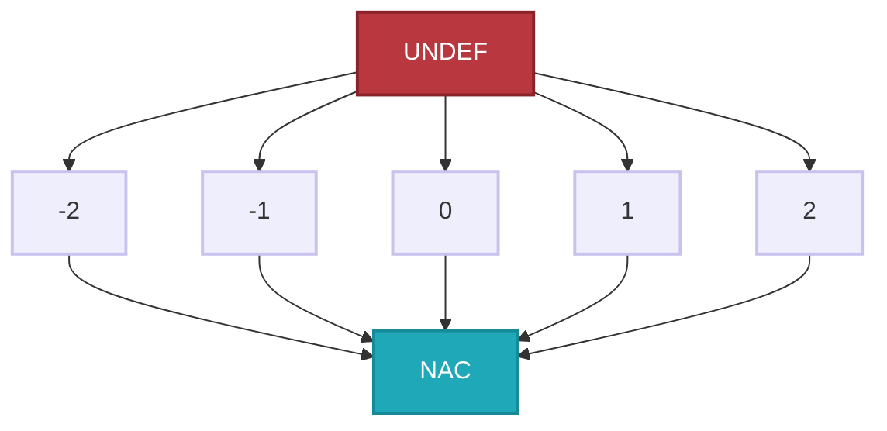

## 内容

学完这节课，做一下这节课上几个练习题的解析。

### math

偏序，偏序集

"偏"字什么意思：可以有人互相排不出先后；对应全序，就是任何两个元素都能比较

#### 1. 偏序集 (P, ⊑)：三条规则

把 P 想成一群元素，⊑ 是元素之间的"排名规则"（偏序关系）。这个规则必须讲道理：

1. **自反**：$\forall x \in P, x \sqsubseteq x$。自己和自己排名相同——任何合理的"小于等于"都该如此。
2. **反对称**：若x ⊑ y 且 y ⊑ x，那 x 和 y 必须是同一个元素。否则会出现"A 排在 B 前面、B 又排在 A 前面"的循环，排名就乱了。
3. **传递**：x ⊑ y 且 y ⊑ z ⟹ x ⊑ z。大鱼吃小鱼式的链式传递。

三条都满足的 (P, ⊑) 叫偏序集。

#### 上界和下界（Upper/Lower Bounds）

定义：Given a poset $(P, \sqsubseteq)$ and its subset $S$ that $S \subseteq P$, we say that $u \in P$ is an _upper bound_ of $S$, if $\forall x \in S$, $x \sqsubseteq u$. Similarly, $l \in P$ is a _lower bound_ of $S$, if $\forall x \in S$, $l \sqsubseteq x$.

- **上界 u**：S 里的每个元素都"不超过"它 → 它站在整个 S 头上（≥ 所有成员）。
- **下界 l**：它"不超过" S 里的每个元素 → 它趴在整个 S 脚下（≤ 所有成员）。

最小上界和最大下界；也就是上界中找最小，~以此类推

![[Source/500_Attachments/501_Images/05-06_20260827_2.png]]

lub（join）和glb（meet）不一定是S的本身，如图所示，这些上下界都是对于S而言的。根据定义来看比较准确。

若S只包含两个元素a和b，我们也可以将$\sqcup$S写为a$\sqcup$b，$\sqcap$S写为a$\sqcup$b。

#### Lattice 格

注意！后面CFG并不能与lattice转换。Lattice只是用于把CFG中的状态抽象出来！方便分析

即一个偏序集里面，任意两个元素都能向上join，或者向下meet；即任意两个元素都有LUB和GLB；也就是两个元素一定有一个元素比另外一个大。

以下就像是两个自然数相比，肯定有一个是比另一个大于等于的。

![[Source/500_Attachments/501_Images/05-06_20260831_2.png]]

以下就不是lattice，因为pin和sin并不能比较，故不满足任意两个元素都有LUB和GLB

![[Source/500_Attachments/501_Images/05-06_20260831_1.png]]

最直观的例子就是幂集格；因为其中的$\sqcup$（join）可以看作并，$\sqcap$（meet）可以看作交

![[Source/500_Attachments/501_Images/05-06_20260827_4.png]]

#### Semilattice（半格）

也就只存在LUB或者GLB

#### Complete Lattice 重点！

比Lattice（任意两个元素有LUB和GLB）更严格，除了是个lattice，还需满足格中任意子集中LUB和GLB存在；

比如，(ℕ, ≤)：

- **任意两个**（3 和 7）→ join=7、meet=3，成立 ✅
- **任意子集**（全体自然数）→ 没有最大数，LUB 不存在 ❌

任何完全格都有一个
最大的元素 $\top$  = $\sqcup P$ 叫作top
最小的元素 $\bot$  = $\sqcap P$ 叫作bottom

任何一个有限格(finite lattice)都是一个完全格；
有限格就是元素有限

#### 乘积格

```ad-note
我对乘积格又有了一个理解，就是CFG每个node的output为一个L，那么~~迭代k次~~k个节点（这里的误区[同下面](NJU软件分析-05-06#不动点的高)）的output为product lattice，也就是这个lattice包含着所有的抽象状态，所以我们研究这个product lattice？但是我不懂为什么他叫product，这个product在哪？

这个product在笛卡尔积上，具体来说就是，把k个集合两两组合
- n1 的可能 OUTPUT = {∅, {a}}（2 种）；
- n2 的可能 OUTPUT = {∅, {a}}（也是 2 种）。
那么$n1 \times n2$:
	- n1=∅, n2=∅   →  (∅, ∅)
	- n1=∅, n2={a} →  (∅, {a})
	- n1={a}, n2=∅ →  ({a}, ∅)
	- n1={a}, n2={a}→  ({a}, {a})
```

前面说一个 CFG 有 k 个结点，每个结点都自带一个数据流值。但**一次迭代算的是整个程序**，所以要把这 k 个值**打包成一个整体**，当作一份状态。打包后的那个整体，叫"状态向量"（一个 k 元组），它住在**乘积格** $L^k$ 里。

所以：乘积格的**含义不是某个结点的值**，而是 **"整个程序当前各结点值"的一份快照**。

也就是把不同的P打包成一个元组，然后在进行比较的时候各比各的

定义：给定一组格，$L_1 = (P_1, \sqsubseteq_1)$，$L_2 = (P_2, \sqsubseteq_2)$，…，$L_n = (P_n, \sqsubseteq_n)$，都有上确界 $\sqcup_i$ 和下确界 $\sqcap_i$，则定义乘积格 $L^n = (P, \sqsubseteq)$：

1. $P = P_1 \times \cdots \times P_n$

```ad-warning
这里的P是啥？
答：乘积格中的Domain？感觉是这样；$P_n$为n个k-tuple，也就是每一轮各个node的状态的向量。我们把n个tuple做笛卡尔积，得到了P；下面举个例子
```

````ad-note 例子
collapse: true
## 实际例子：一个只有 2 个程序点的程序

```
        (n1)  x = 1        ← 程序点 n1
          |
        (n2)  y = x + 2    ← 程序点 n2
          |
        (n3)  return y     ← 程序点 n3
```

这个程序有 **3 个程序点**，所以一份"状态"是 3 个数排成一行。为了好懂，我让每个点只记一个简单东西。

## 第一步：给每个点定"它能记哪些数"（这一步你已经懂了）

- 点 n1 能记的数：`{1, 2, 3}` （定义域 P₁）
- 点 n2 能记的数：`{5, 6}` （定义域 P₂）
- 点 n3 能记的数：`{8}` （定义域 P₃）

每个点能记的值，**互不干扰**。n1 能记 1/2/3，跟 n2、n3 完全没关系。

## 第二步：一份"状态"= 每个点各记一个数，排成一行

比如某一时刻，程序是这样：

```
n1 记 2,  n2 记 5,  n3 记 8
```

写成一行：`(2, 5, 8)`。这就是一个**元组**，也就是一份**完整状态**（x₁=2, x₂=5, x₃=8）。

再换一种可能：`n1 记 3, n2 记 6, n3 记 8` ⟹ `(3, 6, 8)`。

## 第三步：所有可能的"状态"拼起来 = 乘积格

现在我把**所有**能拼出来的状态都列出来（第1位从{1,2,3}选，第2位从{5,6}选，第3位只能是8）：

```
(1,5,8)   (1,6,8)
(2,5,8)   (2,6,8)
(3,5,8)   (3,6,8)
```

就这 **3 × 2 × 1 = 6 份**状态，一份不多一份不少。这个"共有 6 份、每份都是逐位取值"的**集合**，就是乘积格。而上面那个 `(2,5,8)` 只是其中**一份**（一个元素）。

````

2. $(x_1, \ldots, x_n) \sqsubseteq (y_1, \ldots, y_n) \iff (x_1 \sqsubseteq y_1) \land \cdots \land (x_n \sqsubseteq y_n)$

对每一分量 i，其两个元素在第 i 个格的偏序 ⊑ᵢ 下都要满足 xᵢ ⊑ᵢ yᵢ；所有分量同时满足时整体关系才成立。

3. $(x_1, \ldots, x_n) \sqcup (y_1, \ldots, y_n) = (x_1 \sqcup y_1, \ldots, x_n \sqcup y_n)$

4. $(x_1, \ldots, x_n) \sqcap (y_1, \ldots, y_n) = (x_1 \sqcap y_1, \ldots, x_n \sqcap y_n)$

上面两个是最小上界和最大下界的关系。

> $(x_1, \ldots, x_n)和(y_1, \ldots, y_n)$这两个东西是啥？这两个是乘积格？
> 这两个不是乘积格，而是

**性质：乘积格也是格，完全格构成的乘积格也是完全格**

- $x_1, y_1 \in P_1$（第 1 个格 $L_1 = (P_1, \sqsubseteq_1)$ 的集合）
- $x_2, y_2 \in P_2$
- ...
- $x_n, y_n \in P_n$

而 $x = (x_1, ..., x_n)$ 这个整体 $\in P = P_1 \times ... \times P_n$（在积分格 $L^n$ 里）。

### 基于格的数据流分析框架

现在，我们再次回到数据流分析上，定义一个基于格的数据流分析框架$(D, L, F)$：其中$D$指的是数据流的方向，包括前向和后向；$L$指的是由值域$V$和一个meet或join操作符构成的格；$F$指的是从$V$到$V$的一系列transfer functions。

更简短的说，L管domain和merge时候的操作，F管传递之间的操作。

![[Source/500_Attachments/501_Images/NJU软件分析-05-06_20260907_3.png]]

实际上，数据流分析可以视作在格上不断迭代应用transfer functions和meet/join操作：

![[Source/500_Attachments/501_Images/05-06_20260831_3.png]]

不过这里的IN\[s2]和OUT\[s2]我感觉还要加上高亮{a},{b}以及{a,b}(这里由Transfer Function变成{a,b,c});

### 单调性（Monotonicity）和不动点（Fixed Point）定理

#### 问题引入：迭代算法（或者叫IN/OUT方程组）能解决数据流分析问题。

- 这个算法能保证一定结束或者达到固定点吗？或者它总能找到解？

*   如果能，那只有一个解或者只有一个固定点吗？如果不止一个，那我们的解是最好的（最精确）吗？

根据不动点定义 $x = f(x)$ 即为不动点，故可以有多个不动点

![[Source/500_Attachments/501_Images/05-06_20260831_4.png]]

-   算法什么时候能达到固定点？或者我们什么时候能得到解？

#### 证明

##### 证明不动点的存在

前面我们提到，最小元素 $\bot = \sqcap L$ 是格上的最小元素，且 $f$ 是单调的，因此我们可以得到：

$$
\bot \leq f(\bot) \leq f^2(\bot) \leq \ldots f^H(\bot)
$$

而 $L$ 又是有限的，假设其高度为 $H$，则上述数列的上限就是 $f^H(\bot)$。当 $i > H$ 时，根据鸽笼原理，存在 $k$ 和 $j$ 使得 $f^k(\bot) = f^j(\bot)$，假设 $k < j \leq H + 1$。结合 $f$ 是单调的，又有 $f^k(\bot) \leq \ldots \leq f^j(\bot)$，因此可得 $f^{Fix} = f^k(\bot) = \ldots = f^j(\bot)$。故不动点存在。

注：格的高度的概念出现在下一节，指的是在格上从top到bottom的最长路径。

##### 证明该（由bottom上升而来的不动点）不动点是最小不动点

这里我们使用归纳法证明：

1. 假设还有一个不动点 $x$，使得 $x = f(x)$。由于 $\bot$ 是最小元素，结合函数单调性，可得 $f(\bot) \leq f(x)$。
2. 假设 $f^i(\bot) \leq f^i(x)$，那么结合函数单调性，我们有 $f^{i+1}(\bot) \leq f^{i+1}(x)$。
3. 因此，我们得证 $f^i(\bot) \leq f^i(x)$。又因为 $x$ 是不动点，故 $f^i(\bot) \leq f^i(x) = x$。
4. 最终有 $f^{Fix} = f^k(\bot) \leq f^k(x) = x$，证毕。

#### 不动点定理

> 单调 + 有限完全格 ⟹ 迭代必然终止，且停在一个"不动点"上。从bottom迭代向上能到最小不动点；从top迭代向下能到最大不动点。

![[Source/500_Attachments/501_Images/05-06_20260901_1.png]]

### 迭代算法转化为不动点理论

**问题**：我们如何在理论上证明**迭代算法有解**、**有最优解**、**何时到达不动点**？那就是将迭代算法转化为**不动点理论**。因为不动点理论已经证明了，单调、有限的完全lattice，存在不动点，且从⊤开始能找到最大不动点，从⊥开始能找到最小不动点。

所以我们要让迭代算法满足不动点理论所必需的条件，有如下条件。

1. L是格，且必须是完全格（complete lattice）——有 top 和 bottom，任意子集有 $\cup/\cap$；
2. L 是有限的（finite）——上升链必然有限、能停在不动点；
3. f 是单调的（monotone）—— $x \leqslant y \Rightarrow f(x) \leqslant f(y)$。

- 只"完全格 + 有限"、F 不单调 ⟹ 迭代可能中途"变回更不精确"，不保证收敛到不动点；
- 只"完全格 + 单调"、L 无限 ⟹ 上升链可能无限拉长，不保证终止；
- 只"单调 + 有限"、不是完全格 ⟹ 没有 ⊥ 作初值，无法从 bottom 起爬。

上一节中，我们已经知道CFG上每个节点的OUT都对应一个完全（有限）格$L$，整个CFG上所有节点的OUT就构成了一个乘积格。对于乘积格$L^k$来说，如果构成它的每个格都是完全（且有限）格，那么$L^k$也是完全（且有限）格。至此，迭代算法满足不动点定理的两个条件（格的有限性和完全格）。

接下来，我们需要证明迭代算法对应的函数$F$是单调的。根据之前的知识，$F$由两部分组成：

1. transfer function $f$。
2. join/meet function $\sqcup/\sqcap: L \times \ldots \times L \to L$（控制流汇聚）。

根据之前的知识，Gen/Kill总是单调的（比如总是趋于全1或者全0），因此transfer function $f$是单调的。现在来证明一下join/meet function也是单调的，以join为例：$\forall x, y, z \in L, x \leqslant y$，证明$x \sqcup z \leqslant y \sqcup z$。（这里是把join/meet当作一个函数f，如果$x \leqslant y$那么$f(x)\leqslant f(y)$）

1. 由$\sqcup$的定义（最小上界）可知，$y \leqslant y \sqcup z$。
2. 根据$\leqslant$的传递性可知，$x \leqslant y \sqcup z$。
3. 因此，$y \sqcup z$是$x$的上界，也是$z$的上界。
4. 而$x \sqcup z$是$x$和$z$的最小上界，因此$x \sqcup z \leqslant y \sqcup z$。

于是，我们证明了join function也是单调的，故不动点定理适用于前述迭代算法。

因此，根据不动点定理，前述迭代算法一定能达到不动点（问题1），且一定能够到达最小（最大）不动点（问题2）。

#### 不动点的高

一个格的高 h，就是从顶部到底部在格中走的最长路径的长度。

```ad-error
比如下图这样的格，实际上就代表CFG有3个node(因为有三个元素)，也就是k为3,然后他的高为3,那么最坏需要迭代9次，就是把a,b,c分别看作是三个位子上的0/1;比如abc就是111,ab就是110这种。
```

以上CFG有三个node这句话错了！CFG有几个node在lattice中并不能窥见。lattice表示的是 _程序可能出现的output的集合！_

![[Source/500_Attachments/501_Images/NJU软件分析-05-06_20260904_2.png]]

第三个问题实际上是问在最坏情况下，需要经过多少次迭代才能达到不动点。我们假设每次迭代只在一个节点OUT对应的格上走了一步，而格的高度是$h$（在格上从top到bottom的最长路径），CFG有$k$个节点，那么最多需要$i = h * k$次迭代才能达到不动点。至此，三个问题回答完毕。

这里格的高度！实际上对应的是一个node！从bottom迭代到top所要用的轮次！

### 格视角下的May/Must分析

所有may/must分析都是从unsafe到safe迭代的。转换到格表示，但是最顶端的safe状态并不可用，因为太大了！

```ad-note
注意，safe可能是bottom也可能是top，视情况而定。
我觉得bottom和top就是按照任务来定义，top就是元素都true的状态，bottom则反之
```

比如我们用live variable analysis来分析是否有available的变量可以做优化，那么我们的top就是，所有都available，都可以拿来做优化，这显然是unsafe的。那么bottom就是，所有的都unavailable，这显然是safe的，但是useless，太绝对了，都不能优化我还分析个啥。

![[Source/500_Attachments/501_Images/NJU软件分析-05-06_20260905_2.png]]

以reaching definition举例，我们分析的时候是一点点从bottom往top走，但是我们怎么知道分析能超过truth这一点？

因为我们设计分析的时候，需要得到的结果一定是safe的（如果不safe，我们怎么用这个结果？）。我们分析的迭代是根据transfer fuction和control flow merge迭代上去的，而这两个是根据safe approximation设计的；

然后在程序分析迭代的过程中，我们可能有很多个不动点，我们求的最小不动点就是满足safe（sound）和useful的点。然后程序分析总是从准到不准走，所以我们找到的最小不动点已经是满足soundness和precision最好的点了

![[Source/500_Attachments/501_Images/NJU软件分析-05-06_20260905_3.png]]

还有另一个视角可以理解。通过transfer function迭代的时候，迭代规则都是固定的，因为Gen\Kill都是写死的。而control flow merge又是join\meet，以join举例，在lattice视角就是union，取两个元素的最小上界，故为minimal step，就是我们最小就挪动这么多，故我们到fixed point的时候就是最小不动点。

### MOP和分配性（Distributivity）

接下来研究一下分析精度：我们得出的解的精度如何呢？这里介绍一下另一种解法：Meet-Over-All-Paths（MOP）。

MOP也是一种寻找解的方法，但其寻找的是理想解。也就是理论上的最优解。

#### MOP

从名字上可以看出其的方法。MOP就是对到达点 Si 的**每一条路径**，先沿这条路径一路算到底，再把这些结果**汇合**。也就是所有路径都算过之后，在某位进行合并。

![[Source/500_Attachments/501_Images/NJU软件分析-05-06_20260907_1.png]]

有些path在动态运行的时候不会执行，但是静态分析的时候可能存在；

#### 证明MOP比迭代法更优

对比而言，我们之前介绍过的Iteration algorithm是在每个merge的时候应用join/meet

![[Source/500_Attachments/501_Images/NJU软件分析-05-06_20260907_2.png]]

在此基础上，我们来讨论一下迭代算法结果和MOP结果的关系：

- 根据 $\sqcup$（最小上界）的定义可知，$x \leqslant x \sqcup y$ 且 $y \leqslant x \sqcup y$，
- 转换函数 $F$ 是单调的，因此有 $F(x) \leqslant F(x \sqcup y)$ 及 $F(y) \leqslant F(x \sqcup y)$，
- 故 $F(x \sqcup y)$ 是 $F(x)$ 和 $F(y)$ 的上界，而 $F(x) \sqcup F(y)$ 又是 $F(x)$ 和 $F(y)$ 的最小上界，
- 因此可得 $F(x) \sqcup F(y) \leqslant F(x \sqcup y)$，即 $MOP \leqslant Ours$。

也就是说，我们的迭代算法的“精确度”通常要小于等于MOP。当转换函数 $F$ 具有分配性（distributive）时，$MOP = Ours$，两者精确度才相同。事实上，我们在学习迭代算法时遇到的bit vector也好，gen/kill也好，集合交并集操作也好，都是distributive的。

然而，有一些数据流分析应用是not distributive的，比如下面这个常量传播分析。

### 常量传播分析

#### 背景

`x = 1; y = x + 2;` 这段代码里，`x` 和 `y` 写完后就没再变过。编译器如果**知道**这些是常量，就能把 `y` 直接替换成 `3`，省掉一次运行时加法。替换常数能带来更多优化机会：常量折叠、死代码消除（若之后 `if (y == 3)` 恒真，那个分支可删）、强度削减等。

问题在于：一个变量在程序点是否 `保证` 为某个常量，比看起来难判断。看这段：

```c
int f(int a) {
    a = 2;
    if (c) a = 3;   // c 可能是真也可能是假
    return a;       // 这里 a 到底是 2 还是 3？
}
```

两条路径一个让 `a=2`、一个让 `a=3`，返回到这里**不能保证** `a` 是单一常量。所以常量传播不是「猜」，而是做**保守的、保证正确**的推断：只有当所有可能路径都让变量等于同一常量时，才断定它是常量。这就是 must 分析。

```ad-question
常量传播是一个和reaching definition，live variable同类型的一个概念吗？

**是同一个家族：它们都是「数据流分析（Data Flow Analysis）」下的具体实例。但类型不同，要注意区分。** 常量传播和 Reaching Definitions、Live Variable 是同一类概念（都是数据流分析框架 `(D, L, F)` 的实例），但属于不同的「题型」。
```

#### DLF框架

上一节中，我们定义一个基于格的数据流分析框架$(D, L, F)$：其中$D$指的是数据流的方向，包括前向和后向；$L$指的是由值域$V$和一个meet或join操作符构成的格；$F$指的是从$V$到$V$的一系列transfer functions。

首先是方向$D$。很明显，常量传播分析应该是一个前向分析，因为对于每个节点来说，需要考虑的是前驱节点对它的影响。

接下来讨论格$L$，它的值域$V$如下所示，由UNDEF、常量和NAC（not a constant）组成：



由于可以当作must来看，然后我们做safe approximate是从unsafe走向safe。故可以推断如下观点：

top一定是safe but useless，也就是说，所有变量都不能看成常量做优化

bottom一定是unsafe，即，所有变量都能看成常量做优化。

按照先前的must analysis，我们的top应该初始化为空，但是这里我们初始化称了undef，因为在这个分析里，CFG中每个节点的OUT应该是一个由$(x, v)$对组成的集合，其中$x$是变量，$v$是在该节点后$x$的值。

一个程序还没开始运行，变量里面的值是不确定的，所以初始化为undef。

##### 常量传播的Lattice定义

抽象域（Domain）

每个变量在程序点的状态是一个抽象值，三种：

- **`UNDEF`**：还没有任何信息（未初始化）；本讲不重点展开。
- **`c`**：确定是常量 `c`。
- **`NAC`**（Not A Constant）：在不同路径上取了不同值，**无法保证**是单一常量。

merge操作用meet $\sqcap$（最大下界），因为这是 must 分析：，它需要根据不同情况执行不同的操作：

- $\text{NAC} \sqcap v = \text{NAC}$
- $\text{UNDEF} \sqcap v = v$
- $c \sqcap v = ?$
  - $c \sqcap c = c$
  - $c_1 \sqcap c_2 = \text{NAC}$

上述操作完全是根据实际需求来定义的。例如，我们并不关心未初始化的变量（UNDEF）。因为一个undef，是uninitialize的情况，如果我们查未初始化元素，是不是就会漏一个？因为这里跟一个value做meet取了value，传下去的就是一个value了

这涉及到了pass的设计理念，也就是解耦的思想。我们可以设想有pass处理过这种情况了。

##### 常量传播的Function定义

接下来考虑转换函数。给定一个语句 $s: x = \ldots$，我们将其转换函数定义为：

$$
F: OUT[s] = gen \cup (IN[s] - \{(x, \_)\})
$$

下面来看如何针对三类不同的语句生成 $gen$：

- $s: x = c$，则 $gen = \{(x, c)\}$
- $s: x = y$，则 $gen = \{(x, val(y))\}$
- $s: x = y op z$，则 $gen = \{(x, f(y, z))\}$

其中 $f(y, z)$ 定义如下：

$$
f(y, z) = 
\begin{cases}
val(y) \, op \, val(z) & \text{if } val(y) \text{ and } val(z) \text{ are constants} \\
\text{NAC} & \text{if } val(y) \text{ or } val(z) \text{ is NAC} \\
\text{UNDEF} & \text{otherwise 有个值是undef}
\end{cases}
$$

其中最下面那个情况，如果得出的结果不是UNDEF，从lattice层面想，那就说明F不是单调的了。

另外，如果 $s$ 不是一个赋值语句，那么转换函数 $F$ 不起作用，相当于空函数即可。

下面这个小例子说明，常量传播分析是 not distributive 的：

![[Source/500_Attachments/501_Images/NJU软件分析-05-06_20260907_4.png]]

我们迭代求出来的是NAC，MOP求出来的是10,进一步作证了MOP更加准

### Worklist算法

对标iterated algorithm，相当于其的一个优化。就是不变的块可以不用重算一遍。

##### 拿 reaching definitions（forward）的朴素算法：

```
OUT[entry] = ∅
for B != entry: OUT[B] = ∅
while 某个 OUT 变化了:
    for 每个 B != entry:
        IN[B]  = ∪{ OUT[P] | P ∈ pred(B) }
        OUT[B] = gen[B] ∪ (IN[B] − kill[B])
```

它每轮把**所有**基本块重算一遍。但很多块的 OUT 明明没变——它们的输入没变，输出自然不会变，重算它们纯属浪费。迭代次数可能远大于实际「真正受影响」的块数。

##### 二、Worklist 的核心思想：只重算「受影响」的块

关键观察：**一个块的 OUT 只有可能因某个前驱的 OUT 变化而改变**。所以在 forward 分析里：

> 只有当一个块的 OUT 真的变了，才可能影响它的**后继**者 → 把后继者加进待处理队列（worklist）。

这样我们只重算「确实可能被影响」的块，跳过没变化的。

```
1 初始化所有 OUT（初值）
2 worklist = 所有基本块        ← 一开始全部要算
3 while worklist 非空:
4     B = 从 worklist 取出一个块
5     old = OUT[B]
6     IN[B]  = merge(OUT[P] for P in pred(B))   ← 汇合（用 ⊔/⊓）
7     OUT[B] = transfer_B(IN[B])                ← 迁移（用 f）
8     if OUT[B] != old:                          ← 只有变了才扩散
9         把 successors(B) 加入 worklist         ← forward：入后继
```
